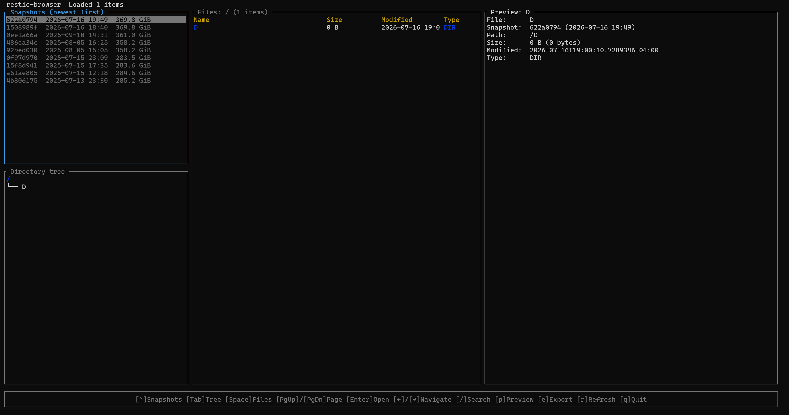

# restic-browser

[ [English](README.md) | 中文 ]

`restic-browser` 是一个只读 TUI，用来浏览本地 restic 仓库、查看文件在不同快照中的
版本历史、搜索快照、预览文本、图片和视频帧，并安全导出文件或恢复目录。Windows x64
是当前发布优先级；代码和 CI 同时面向 Windows、Linux 和 macOS。



## 当前实现

- 默认后端是第三方 Rust 实现 `rustic_core`，打开仓库后复用同一个解锁会话。
- `--backend restic-cli` 显式启用 restic 0.19.x CLI 对照/回退后端；不会静默回退。
- ffmpeg 和 ffprobe 是外部依赖，用于媒体元数据和视频单帧预览。
- 密码只保存在当前进程内存；产品功能只读仓库，文件导出和目录恢复均拒绝覆盖。
- 当前只正式支持本地仓库，不提供备份、删除、修复或迁移功能。
- 界面默认使用英文；添加 `--cn` 可启用中文。

```powershell
restic-browser.exe -r D:\backup\restic-repo
restic-browser.exe -r D:\backup\restic-repo --backend restic-cli
restic-browser.exe -r D:\backup\restic-repo --cn
```

也可通过 `RESTIC_REPOSITORY` 指定仓库。`--ffmpeg`、`--ffprobe` 可覆盖媒体工具路径；
CLI 回退后端还支持 `--restic`。`--log-file` 启用脱敏诊断日志。

## 文档

- [v0.1 产品目标、流程、键位和验收](docs/product-v0.1.md)
- [当前架构、安全边界和性能特征](docs/architecture.md)
- [`rustic_core` 迁移状态、风险和完成条件](docs/rustic-core-migration.md)

## 构建

需要稳定版 Rust 工具链；Windows MSVC 目标还需要 Visual Studio C++ Build Tools。

```powershell
cargo fmt --check
cargo clippy --all-targets --all-features -- -D warnings
cargo test --locked
cargo build --release --locked
```
