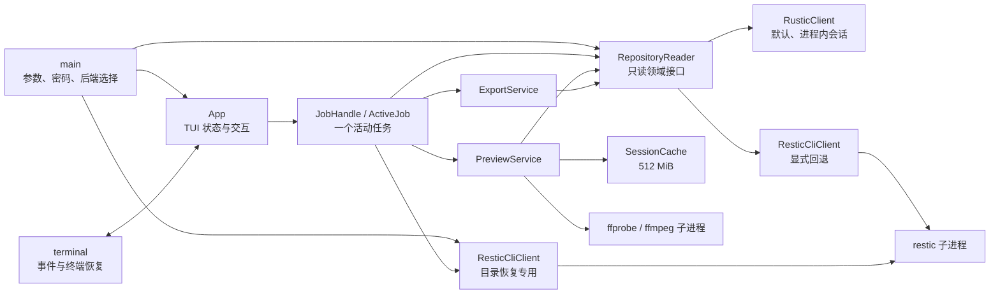

# restic-browser 架构

## 文档状态

本文描述当前代码。默认 `rustic_core` 后端、CLI 回退和懒索引已经实现；目录预取、目录结果
缓存、远程后端和完整 `JobManager` 服务仍是未来设想。

## 系统概览

## 模块职责

### 入口和后端选择

`main.rs` 解析参数、启用可选日志、检查所选仓库后端、隐藏输入密码并构造后端。默认
`--backend rustic` 使用 `RusticClient`；显式 `--backend restic-cli` 时在启动阶段检查
restic 0.19.x。两条路径都先列快照验证仓库，再进入 TUI，不做浏览后端的静默回退。
入口还会构造一个共享的 CLI 客户端供目录恢复使用；rustic 浏览模式只在实际恢复目录时
检查 restic，普通浏览、预览和文件导出不因此依赖 CLI。

ffmpeg 和 ffprobe 按需启动；缺少媒体工具只影响对应的媒体预览，不阻止浏览、文本/图片
预览和导出。

### 只读仓库接口

`repository.rs` 的 `RepositoryReader` 是 TUI 和仓库实现之间的最小对象安全接口：

- 列快照；
- 列指定快照的一个目录层级；
- 在指定快照搜索；
- 查询普通文件在会话快照集合中的同路径历史；
- 将一个文件读取到指定本地路径；
- 报告内容完整索引是否已经就绪。

接口只使用 `Snapshot`、`FileEntry`、`SearchResult`、`FileVersion` 等应用领域类型，不向上层暴露
`rustic_core` 类型或 CLI JSON。`PreviewService`、`ExportService` 和 `App` 都依赖同一个
`Arc<dyn RepositoryReader>`，所以切换后端不改变 TUI 行为。

### 默认 RusticClient

`rustic.rs` 使用固定版本的第三方 `rustic_core`/`rustic_backend`：

1. 本地 backend 打开并解锁仓库。
2. 启动时建立仅含 blob ID 的索引 `to_indexed_ids()`，用于快照和目录树读取。
3. 列目录时从快照树只迭代当前层；搜索时递归迭代所选快照。
4. 首次读取文件内容时把仓库状态升级为 `to_indexed()` 完整索引，之后复用。

`rustic_core` API 是同步的。`BlockingExecutor` 使用一个专用工作线程串行执行仓库操作，
通过 oneshot 把结果交回 Tokio，避免阻塞 TUI 事件循环。迭代目录、搜索和写文件时检查
取消令牌；正在执行的索引升级本身无法中断。

### CLI 回退

`restic.rs` 的 `ResticCliClient` 实现相同接口，并额外提供不属于 `RepositoryReader` 的
目录恢复能力。生产命令白名单为 `snapshots`、`ls`、`find`、`dump` 和 `restore`。每个
操作启动独立 restic 子进程并收集 JSON/输出；stdout 上限为 128 MiB，stderr 上限为
4 MiB，取消会 kill 并 wait 子进程。

### TUI、应用状态和任务

`terminal.rs` 使用 Crossterm/Ratatui，负责 raw mode、备用屏幕、绘制、事件读取和恢复。
它处理 Press/Repeat、忽略 Release，避免某些终端把按下和松开各处理一次。

`app.rs` 保存快照、当前目录、选择、焦点、输入模式、版本历史、预览、状态文本和一个
`ActiveJob`。目录、搜索、版本历史、预览、文件导出和目录恢复在后台执行。版本历史在
文件光标停留 300 ms 后排队，使用有界会话缓存，并且不会抢占用户发起的预览或导出；
其他新任务取消并替换旧任务，`Esc` 取消当前任务。当前没有并发预取或任务优先级队列。
`model.rs` 中有会话状态机领域类型，但运行时尚未接入手动锁定流程。

### 预览、导出和缓存

`PreviewService` 先通过仓库接口把文件读取到 `SessionCache`，然后：

- 文本最多读 2 MiB；
- 图片由 `image` 解码并交给 `ratatui-image`；
- ffprobe 读取媒体 JSON，ffmpeg 生成最大 1280 像素宽的视频 PNG 单帧；
- 音频和未知格式降级为元数据；
- 源文件超过 512 MiB 时不读取内容。

图形协议查询失败时使用 Unicode half-block。媒体进程只接触已读取的临时文件，不接触
仓库或密码。

`ExportService` 拒绝已有目标，在目标同目录建立随机临时文件，读取成功后
`persist_noclobber`。失败或取消时临时对象由作用域清理。

目录恢复始终使用共享的 `ResticCliClient` 执行 `restore --overwrite never`。应用先独占
创建“父目录/原目录名”，成功后保留，失败或取消时清理本次创建的目录。输入路径支持通过
平台用户目录展开 `~`。

`SessionCache` 是会话临时目录，容量上限 512 MiB，超限时删除最早注册的文件，退出时
删除目录；它不是严格按访问时间更新的 LRU。`rustic_core` 和 restic CLI 另有各自的平台
缓存，生产代码使用其默认位置。

## 进程与库边界

| 能力 | 默认 `rustic` 后端 | `restic-cli` 回退 |
| --- | --- | --- |
| 仓库打开/解锁 | 进程内 `rustic_core` | 每个 restic 子进程 |
| 快照、目录、搜索、读取 | `rustic_core` 只读适配器 | 参数数组启动 restic |
| 目录恢复 | 统一调用独立 restic CLI 客户端 | `restic restore` |
| 仓库写命令/API | 不暴露、不调用 | 不调用会修改仓库的命令 |
| 媒体元数据/帧 | ffprobe/ffmpeg 子进程 | ffprobe/ffmpeg 子进程 |

所有外部进程通过参数数组启动，不经过 shell，stdin 关闭。CLI 密码只进入对应 restic
子进程环境；ffmpeg/ffprobe 从不接收密码。

## 密码、日志、临时文件和只读安全

- 密码由隐藏 TTY 输入一次，不写配置或凭据库。
- 默认后端把密码交给 `rustic_core` 完成打开后立即清零输入字符串；解锁后的仓库密钥仍
  按库的会话状态保存在进程内存。
- CLI 后端用 `SecretString` 保存密码，并只通过 `RESTIC_PASSWORD` 传给当前子进程。
- 日志只有指定 `--log-file` 才启用；已知敏感字段所在行统一替换为 `[redacted]`。
- `rustic_core::Repository` 本身也有写 API，但 `RepositoryReader` 不暴露这些能力，当前
  适配器只调用打开、索引、快照树读取和 dump。真实仓库测试比较操作前后文件内容。
- 允许的本地写入只有库自身缓存、会话临时目录以及用户明确选择的文件或目录恢复目标。
- 强制终止或断电不能保证 Rust 析构运行，可能遗留系统临时目录；当前没有跨会话扫描。

## 跨平台与终端兼容原则

- 修复应是解决根因的最小改动，并保持 Windows、Linux、macOS 行为。
- 本地路径使用 `PathBuf`/`OsString`，进程使用参数数组，不依赖 shell 或控制台代码页。
- 仓库内文件名以 Unicode 领域字符串传递，中文、空格和 Emoji 已有真实仓库测试。实际
  字形仍取决于终端字体，缺字不能阻止读取和导出。
- 默认 backend 当前要求仓库根路径可转换为 UTF-8；中文/Emoji 等有效 Unicode 路径正常。
  Unix 上含无效 UTF-8 字节的仓库根路径需显式使用 CLI 后端。
- 密码提示使用跨平台 TTY；键盘事件基于 Press/Repeat/Release 语义，不绑定某一终端。
- 图形协议是可选增强，查询失败时降级；CI 在 Windows、Linux、macOS 编译和测试。

## 目录与文件读取延迟

默认后端已经消除了每次进入目录都启动 restic、重复 scrypt 解锁造成的约 0.5 秒固定
开销。CLI 回退仍保留这一成本。

默认后端仍有三类真实成本：

- 启动时 `to_indexed_ids()` 读取仓库索引 ID，成本随仓库索引规模增长。
- 首次访问某个目录时读取对应快照树；一个含数千直接子项的目录需要 O(该层项目数) 时间和
  一个同规模 `Vec<FileEntry>`，但不会因此加载其所有后代。
- 首次预览或导出触发 `to_indexed()` 完整内容索引，可能突然增加 CPU、内存和 I/O；完成
  后会话内复用。索引升级当前不能中途取消，失败后需要重新打开仓库。

搜索递归遍历所选快照并把匹配结果整体保存在内存；单次目录和搜索结果最多 100,000 条。
专用仓库工作线程一次只执行一个操作，
避免多次索引/树读取并发放大资源，但长任务也会让后续任务排队。

当前没有 150 ms 停留限制、目录预取或目录缓存。大型仓库是否需要有界缓存，应基于性能
数据另行决定，不能用无界预加载替代。
