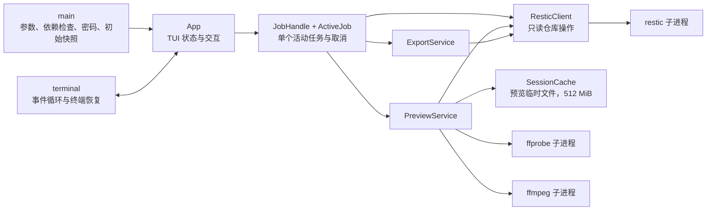

# restic-browser 架构

## 文档状态

本文以当前代码为准。`rustic_core` 迁移、目录预取和目录结果缓存均尚未实现；相关方案单独
记录在 [rustic-core-migration.md](rustic-core-migration.md)。

## 当前系统概览

### 启动入口

`main.rs` 负责解析 CLI、启用可选日志、检查依赖、隐藏输入密码、构造服务和读取初始快照。
当前启动顺序要求 restic、ffmpeg 和 ffprobe 都可用，即使本次会话不打开媒体预览。
仓库或认证验证失败时程序直接退出，不进入 TUI。

### TUI 与应用状态

`terminal.rs` 使用 Crossterm 和 Ratatui：

- 进入 raw mode 和备用屏幕，循环绘制并轮询事件。
- 忽略 `KeyEventKind::Release`，避免一次按键在某些终端被处理两次；保留正常的按键重复。
- `TerminalGuard` 在正常返回和 Rust 栈展开时恢复终端状态。

`app.rs` 的 `App` 保存快照、当前目录条目、焦点、输入模式、预览、状态文本和一个活动任务。
它处理键盘命令并把耗时操作交给后台任务。界面分为快照列表、文件列表、预览/元数据区和
状态/快捷键区。

`model.rs` 定义了领域对象，包括 `Snapshot`、`FileEntry`、`SearchResult`、
`MediaMetadata` 和 `PreviewArtifact`。其中也有 `SessionStateMachine` 和
`JobStatus` 类型，但当前运行时尚未接入完整的 `Locked → Opening → Ready` 状态机，
也没有手动锁定功能。

### ResticClient

`restic.rs` 是当前仓库读取边界。它持有 restic 可执行文件、本地仓库路径和会话密码，
提供以下实际接口语义：

- 读取并按时间倒序排列所有快照。
- 列出选定快照和路径的直接子项，目录优先排序。
- 用 restic pattern 搜索指定快照。
- 将指定文件内容 dump 到本地路径。

返回值目前是完整的 `Vec` 或已写完的文件，不是流。JSON 输出先完整读入内存再解析。
路径在仓库内部统一规范化为 `/` 分隔；本地可执行文件和导出路径使用 `PathBuf`/
`OsString`。

### 预览

`PreviewService` 先通过 `ResticClient::dump_to_path` 把文件放入会话临时目录，再按类型
处理：

- 文本读取最多 2 MiB，超出部分标记为截断。
- 图片由 `image` crate 解码，再交给 `ratatui-image`。
- 视频由 ffprobe 读取 JSON 元数据，由 ffmpeg 生成最大 1280 像素宽的 PNG 单帧。
- 音频和未知类型不播放；尝试通过 ffprobe 提供元数据。
- 文件大于 512 MiB 时不 dump，也不生成媒体预览。

图像协议通过终端查询自动选择；查询失败时使用 Unicode half-block。当前没有文本滚动、
PDF、音频或连续视频播放。

### 导出

`ExportService` 只导出单个文件。它拒绝已存在的目标和不存在的父目录，在目标同目录创建
随机临时文件，通过 restic dump 写入，成功后使用无覆盖持久化。临时对象在错误或取消
路径中随作用域清理；应用不提供覆盖快捷方式。

### 任务管理

`jobs.rs` 的 `JobHandle<T>` 包装 Tokio `JoinHandle` 和 `CancellationToken`。
`App::ActiveJob` 区分目录、搜索、预览和导出任务。

- 当前最多只有一个活动任务。
- 新操作会取消并替换旧任务。
- `Esc` 取消活动任务。
- restic、ffmpeg 和 ffprobe 等待期间收到取消信号后会 kill 并 wait 子进程。
- `kill_on_drop(true)` 是任务被丢弃或运行时关闭时的补充保护。

当前没有独立的优先级队列、并发预取器或可观察的 `JobManager` 服务。

### 缓存

有两类容易混淆的缓存：

1. **restic 自身缓存**：生产代码没有传 `--no-cache`，因此使用 restic 的平台默认缓存。
   测试可通过 `with_cache_dir` 隔离缓存目录。
2. **SessionCache**：仅保存预览源文件和视频帧。它位于系统会话临时目录，默认上限
   512 MiB，超过上限时按注册先后删除最旧文件，并在正常析构时删除整个临时目录。

当前没有目录列表缓存、快照内容索引或预取。`SessionCache` 也不是按访问时间更新的严格
LRU。

## 子进程边界

### restic

产品代码通过参数数组直接启动进程，不经过 shell。允许的仓库子命令固定为：

| 操作 | 命令 | 数据方向 |
| --- | --- | --- |
| 版本检查 | `restic version` | stdout |
| 快照 | `restic ... snapshots --json` | JSON stdout |
| 目录 | `restic ... ls --json <snapshot> <path>` | JSON Lines stdout |
| 搜索 | `restic ... find --json --snapshot <id> <pattern>` | JSON stdout |
| 读取文件 | `restic ... dump <snapshot> <path>` | stdout 写入本地文件 |

仓库命令统一带 `--repo <local-path>`、空 stdin、`RESTIC_PROGRESS_FPS=0` 和子进程专属的
`RESTIC_PASSWORD`。白名单不包含任何备份、删除、修复或迁移命令。

### ffprobe 和 ffmpeg

两者只读取已经 dump 到会话缓存的本地文件：

- ffprobe 以 JSON 输出格式、时长、码率和音视频流信息。
- ffmpeg 禁用 stdin，只生成指定时间点的一张缩放 PNG。

媒体工具从不接收仓库密码或仓库路径，也不直接访问仓库。

## 安全约束

### 当前实现

- 密码保存为 `SecretString`，不会写入配置、日志或命令参数。
- 密码只通过当前 restic 子进程的环境传递；具有足够系统权限的同机进程仍可能观察进程
  环境，这是 CLI 后端的安全边界。
- 可选日志只在用户提供 `--log-file` 时启用；错误文本中含 `password`、`secret`、
  `access_key` 或 `token` 的整行会被替换为 `[redacted]`。
- 仓库路径、快照 ID、pattern 和文件路径作为独立参数传递，禁止 shell 拼接。
- 产品操作受只读命令白名单约束；写入仅发生在 restic 自身平台缓存、应用会话临时目录
  和用户明确选择的导出目标。
- 导出使用同目录临时文件和无覆盖落盘，避免把半成品暴露为成功结果。

异常断电或强制终止无法保证执行 Rust 析构，因此会话临时目录仍可能需要由操作系统或后续
清理机制处理；当前没有启动时扫描旧临时目录。

## 跨平台与终端兼容原则

- 所有修复必须是解决根因的最小改动，并保持 Windows、Linux、macOS 可移植。
- 使用 `PathBuf`/`OsString` 和 `Command` 参数数组处理本地路径与进程，不依赖 shell
  转义或平台命令字符串。
- 仓库 JSON 按 UTF-8 解析，Rust 字符串保留中文、空格和 Emoji。能否正确绘制还取决于
  终端的 Unicode 宽度实现与字体覆盖；缺字时不得影响浏览、读取和导出。
- 密码提示通过跨平台 TTY 写入和隐藏读取实现，不修改全局控制台代码页。
- 终端图形能力是可选增强；自动查询失败时使用 portable 的 half-block 降级。
- 终端事件按 Press/Repeat 处理、忽略 Release，不绑定某个终端模拟器。
- 当前 CI 覆盖 Windows 和 Linux；Windows x64 是 release artifact 门槛。macOS 是设计
  目标但尚未进入 CI，因此不能表述为已经完整验收。

## 已知目录加载延迟

### 现象

进入未加载过的目录时，当前环境观察到约 0.5–0.8 秒等待；具体时间随 CPU、仓库、缓存和
存储而变化。代码中没有人为的 150 ms 停留限制或固定 0.5 秒延时。

### 根本原因

每次目录查询都会启动新的 `restic ls` 进程。该进程必须重新打开仓库、用 scrypt 验证
密码并取得主密钥，再建立本次命令需要的仓库读取状态。restic 的磁盘缓存能减少元数据
下载和解析，但不会跨进程保留已经解锁的内存会话。TUI 还必须等待子进程结束并完整解析
JSON 后才替换列表。

因此，这不是 Ratatui 绘制或 80 ms 事件轮询造成的延迟。单纯移除 restic 缓存限制已经
完成，但不能消除重复进程和重复解锁成本。

### 规模影响和当前边界

带路径的 `restic ls` 默认只列该层，代码也再次过滤为直接子项，因此不会主动预加载整棵
快照树。一个含数千项目的单层目录仍会创建同规模的 JSON 和 `Vec<FileEntry>`，时间和
内存约为 O(该层项目数)。搜索则会把所有匹配项一次性保存在内存。

目录预取、目录 LRU 和全快照索引均未实现。全量索引会把成本变为 O(快照总条目数)，不适合
作为大型仓库的默认最小修复。当前决定先验证能够保持一次打开会话的 `rustic_core` 后端，
从根因上处理重复解锁，详见迁移文档。

